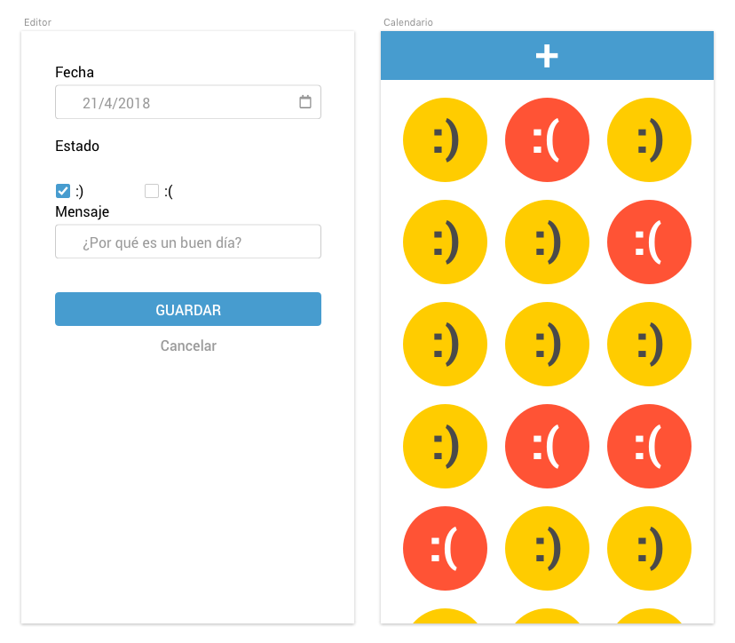

# Prueba técnica 3: ¿Cómo ha ido el día? (Parte 1)

## Resumen

En esta prueba vamos a crear una pequeña webapp en React basada en el [Life Calendar de Brigada Creativa](https://www.etsy.com/listing/258726277/3-life-calendars-how-was-your-day).

Se trata de un calendario en el que cada día vas apuntado qué tal ha ido el día eligiendo un [smiley](https://en.wikipedia.org/wiki/Smiley).
La idea es poder ver un periodo de tiempo en contexto para que los días malos no puedan a los buenos.

## Especificaciones
Tendremos una serie de reglas:
- Solo hay dos opciones, día bueno o día malo:  :) ó :(
- En el caso de un buen día, :), se podrá añadir un mensaje
- Una vez guardado un día ya no se puede editar
- Esta vez no es necesario gestionar los huecos (si me dejo X días sin añadir)
- Navegación:
  - Hay dos vistas, el **editor** y el **calendario**
  - Se accede al editor con el botón `+` que aparece fijo en la parte superior de la pantalla
  - Los botones guardar/cancelar devuelven a la vista de calendario
- Los datos se guardarán en el [local storage](https://developer.mozilla.org/en-US/docs/Web/API/Window/localStorage) del navegador ;)

## Entrega
Tenéis que crear un nuevo repositorio en GitHub desde GitHub Classroom usando [este enlace](https://classroom.github.com/a/gncR3d-x). Una vez creado invitaremos a nuestro voluntario, lo clonaremos en nuestro ordenador y en la carpeta creada empezaremos a trabajar en el ejercicio.

## Inspiración

- https://www.etsy.com/listing/258726277/3-life-calendars-how-was-your-day
- http://sidiostedalimones.com/2014/

## Guión exposición
Os proponemos un guión para presentar el ejercicio pero el entrevistador podrá variarlo o redirigirlo en cualquier momento:
- Descripción breve de la API Local Storage
- Estructura de datos que vamos a guardar
- Estructura de componentes y uso del router
