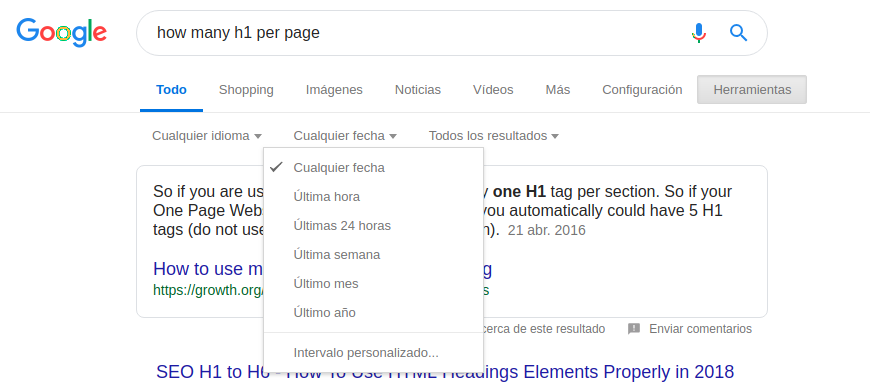

# Guía para enfrentarse a problemas técnicos de manera autónoma

En nuestro día a día los programadores nos encontramos a problemas muchas veces nos resulta difícil solucionar solos.
Afortunadamente existen montones de recursos en los que apoyarnos ya que es probable que no seamos la primera persona enfrentándonos a esta problemática concreta.

## Documentación

Una buena idea es consultar la documentación. 
Recuerda que para HTML, CSS y JS puedes acudir a [https://devdocs.io/](https://devdocs.io/).
Puede ocurrir que la documentación no cubra nuestra duda o que el lenguaje que use aún nos resulte demasiado técnico, en cuyo caso es momento de buscar en Google.

## Búsqueda en google

// TODO: buscar un par de ejemplos

### Filtrando por fecha

Cuando buscamos en Google es una buena idea filtrar por fecha para obtener resultados publicados durante el último año, la tecnología evoluciona muy rápido y lo que era válido en 2014 quizás ya no aplique cuatro años después). 

Podemos hacerlo utilizando el menú bajo la caja de búsqueda y seleccionando en este 'Herramientas'.

Si esta búsqueda no devuelve nada interesante, habría qe el filtro utilizando un intervalo personalizado de 3 o 4 años. 
Si esto sigue sin funcionar, toca quitar el filtro.

### En inglés
Siempre es mejor buscar en inglés, intenta no complicarte con sentencias muy elaboradas. Usa palabras claves sencillas y lo más probable es que Google te sugiera autocompletar la búsqueda en base a lo que han buscado otras personas.

###   Resultados
Una vez hecha la búsqueda lo mejor es comenzar con los resultados de páginas que ya conocemos y en las que confiamos como 'Stack Overflow' o 'Css-tricks'... Si no aparecen ninguna de estas, pues como en cualquier búsqueda empezamos con el primer resultado ;)

## Stack Overflow 

Puede que entre los resultados de Google aparezca [Stack Overflow](https://stackoverflow.com),
una página muy útil para compartir conocimientos.

Lo más probable es que alguien ya haya realizado la misma pregunta o una muy similar y que la comunidad le haya ayudado a resolverla, veamos lo básico de Stack Overflow:

1. Cuando una respuesta tiene un check verde (a su izquierda), esto indica que la persona que preguntó la ha marcado como válida, esta es la que le ayudó a solucionar el problema.

2. A la izquierda de cada pregunta y respuesta también aparece el número de votos que ha recibido de otros desarrolladores. Esto es muy útil, ya que veces respuestas no marcadas como validas tienen más votos que la elegida con check verde. ¿Y eso? Puede que haya pasado mucho tiempo desde que se resolvió la pregunta y nuevas soluciones hayan aparecido, o sencillamente la comunidad tienen una opinión diferente a la persona que preguntó. Así que nunca está de más hacer un poquito de scroll y ver respuestas alternativas.

3. Muchas veces una pregunta viene marcada como duplicada, con un enlace a otra pregunta muy similar.

4. Si no encontramos la respuesta a nuestra pregunta, siempre podemos realizar una nueva, ¡es gratis! Además Stack Overflow te dará algunas pistas para realizar tu pregunta de manera correcta.

## Comunidad
Cuando todo lo demás ha fallado, o hemos encontrado una solución pero no estamos del todo conformes con ella hay que recurrir a la comunidad más cercana, preguntado

1. A compañeras de trabajo
2. En Canales de Slack
3. En Twitter (pegunta abierta a la comunidad)