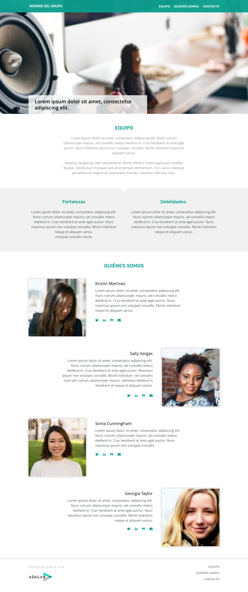
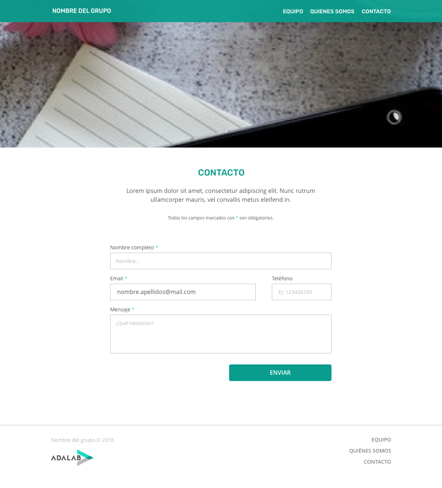

# Proyecto 1: Web grupal

<!-- TOC START min:2 max:2 link:true update:true -->
- [Resumen (TL;DR)](#resumen-tldr)
- [Objetivos](#objetivos)
- [Caso de uso](#caso-de-uso)
- [Especificaciones](#especificaciones)
- [Hitos](#hitos)
- [Entrega](#entrega)
- [Recursos](#recursos)

<!-- TOC END -->

## Resumen ([TL;DR](https://spanish.stackexchange.com/questions/15317/hay-alg%C3%BAn-equivalente-en-castellano-al-ingl%C3%A9s-tldr))

En este proyecto vamos a desarrollar nuestra primera web colaborativa. Para ello crearemos una web con la información social de todos los miembros del equipo. De cara a vuestro CV online (o LinkedIn) es muy importante dar visibilidad de que habéis hecho trabajo en equipo. ¡Esta será vuestra primera experiencia de trabajo en equipo relacionada con programación!

## Objetivos

1. Consolidar el aprendizaje de las tecnologías del sprint Hola Mundo (HTML, CSS, diseño responsive, GitHub pages, Sass, grid, gulp)
1. Utilizar control de versiones en equipo para aprender las ventajas y conflictos que genera
1. Mejorar la comunicación de quiénes sois y cómo os proyectáis como equipo
1. Mejorar vuestras habilidades de comunicación en público al exponer el proyecto en la sesión de retrospectiva

## Caso de uso

Con esta web del equipo podréis ilustrar este primer proyecto realizado en Adalab en vuestro perfil de LinkedIn, añadiendo al resto de compañeros y el enlace al código en GitHub. De esta forma, las empresas podrán ver que durante el programa Adalab habéis adquirido experiencia de trabajo en equipo y podrán acceder fácilmente al código que habéis desarrollado.

## Especificaciones

Se desarrollará una página web con las siguientes características:
- Uso de HTML y Sass (al principio usaréis CSS pero la versión final debe usarlo)
- Uso de mediaqueries y otras técnicas de diseño *responsive* para que la web se adapte al tamaño de pantalla de distintos dispositivos
- Uso de git para el control de versiones del proyecto
- Publicación del resultado en Internet usando GitHub Pages

La web tendrá varias páginas:
- una página principal (*Home*) con la información principal sobre el equipo
- una página de contacto con un formulario para que puedan ponerse en contacto con vosotras
- opcionalmente, una página por cada componente del equipo con información más detallada sobre cada una

Todas las páginas tendrán una cabecera (header) y un pie de página (footer). En la cabecera aparece el nombre del equipo y un menú de navegación que debe mantenerse fijo en la parte superior de la ventana al hacer scroll. En el pie de página aparece el copyright, otro menú y el logo de Adalab.

En la página principal, aparece
- una foto del equipo
- la frase (*claim*) del equipo
- una sección "equipo" con la descripción del mismo (por qué os identificáis como equipo, cosas que tenéis en común) y vuestras fortalezas y debilidades
- una sección de "quiénes somos" con información resumida de cada miembro del equipo: nombre, foto, breve bio y enlaces sociales (Twitter, LinkedIn, GitHub y correo)

En la página de contacto habrá un formulario que recoge información de contacto como nombre completo, email, teléfono y mensaje, y un botón para poder enviarlo (aunque de momento no funcione).

Las páginas principal y de contacto tienen un diseño establecido, al que debéis ajustaros lo máximo posible. El diseño está realizado para 3 tamaños de dispositivo
- móvil, por debajo de 768px
- tablet, desde 768px hasta 1200px
- desktop, a partir de 1200px

Para las páginas de cada componente del equipo, el diseño es libre pero siguiendo la guía de estilo del resto de la web.

Podéis descargar un [archivo ZIP](assets/zip/proyecto1.zip) con los diseños e indicaciones en tres carpetas:  
* **pantallas**, con los diseños
* **medidas** con indicaciones de dimensiones, márgenes y paddings
* **tipografía** con indicaciones de los tamaños, colores y fuentes de cada elemento.

### Iconos y tipografía

Los iconos sociales los podéis sacar de [Font Awesome](https://fontawesome.com/), donde también podéis aprender a cómo usarla.

Las tipografías usadas en el diseño son Open Sans y Rubik, disponibles en Google Fonts.

## Hitos

Os proponemos una serie de hitos como sugerencia para dividir las fases de este proyecto. Siguiendo los principios de las metodologías ágiles estableceremos pequeños ciclos iterativos de forma que al final de cada uno de estos generemos valor real, es decir, algo que nos beneficie y sea perceptible por nuestros usuarios (los visitantes de la web).

### Primero. Arranque del proyecto (kickoff)

- 2 días de trabajo
- Organizar el trabajo a realizar usando Trello, e ir asignando tareas y responsables
- Establecer la organización del trabajo: qué tareas realizar en clase juntas y cuáles por separado en casa

### Segundo. Versión móvil de la web

- 1 semana de trabajo
- Desarrollar la versión para móvil de la web (página principal y contacto) con HTML y CSS
- Crear el contenido de la web: textos e imágenes
- Crear la infraestructura necesaria: repositorio en GitHub y con acceso para todos los miembros del equipo

> **NOTA**:  
Para considerar terminado este hito y todos los siguientes debéis tener publicada la web en GitHub Pages.

### Tercero. Versión responsive de la web

- 1 semana de trabajo.
- Hacer la web para el resto de tamaños de pantalla (tablet, desktop)
- Realizar el formulario de contacto para todos los dispositivos

### Cuarto. Versión final

- 1 semana de trabajo.
- Aplicar las técnicas avanzadas aprendidas en la parte final del curso:
  - Sass
  - Grid en la sección de "quiénes somos"
  - Integración con gulp para automatización de tareas
  - Opcionalmente añadir animaciones y transiciones

### Quinto. Presentación final

- 2 días de trabajo
- El último día del sprint presentaréis la versión final de este proyecto. Para ello tendréis que dejarlo publicado y acabado con tiempo, y organizaros para realizar la presentación.

## Entrega

El formato de entrega de este proyecto será mediante la subida de este a la plataforma de GitHub. Para subirlo, se creará un repositorio en la organización de Adalab. El nombre del repositorio deberá estar compuesto de las siguientes partes, todo ello separado por guiones:
- Nombre de la promoción en minúsculas
- "s" minúscula seguida del número del sprint
- Nombre del equipo en minúsculas

Por ejemplo, el nombre de la primera promoción de Adalab fue "Ada". Si un grupo realizase un proyecto para el primer sprint y el nombre de ese grupo fuese "Lovelace", el nombre del repositorio debería ser "ada-s1-lovelace".

De manera adicional, se deberá activar "GitHub Pages" en el proyecto para que este pueda ser visualizado como una web, es decir, que en el caso anterior, si alguien introdujese la dirección "adalab.github.io/ada-s1-lovelace/" en un navegador web, este mostraría la web que se genera con el código del repositorio.

Por último, para acompañar a la entrega del proyecto, el equipo realizará una presentación de 10 minutos mostrando la web y explicando los siguientes puntos:

- Cómo está estructurada la web y el contenido y el por qué de las decisiones tomadas
- Cómo se ha seguido el diseño proporcionado
- La estructura del código y las partes que se quieran destacar
- Cómo ha sido la organización del equipo, el reparto de tareas y la coordinación a la hora de trabajar todas en el mismo código
- Cuál de las tareas o los puntos ha sido el que más esfuerzo ha requerido
- Cuál de las tareas o partes de la web es la que hace que el equipo esté más orgulloso

Al final de esta presentación habrá un turno breve de preguntas, de manera informal, tanto por parte de otras compañeras como por parte de los profesores.

## Recursos

Para este proyecto hemos preparado un listado de recursos que os pueden servir de ayuda.

### Cómo diseñar una web desde cero

Saber diseñar una web no es un requisito previo para este curso. Tampoco es un objetivo del curso que aprendáis a hacerlo ni os lo exigiremos, por eso hemos preparado una breve guía para aprender a diseñar, para que os sirva como referencia para realizar el diseño de las página individuales y para daros los pasos y la información necesaria para llevar a cabo un diseño básico.

[Guía para diseñar una web desde cero](./P1_anexo_diseno.md)
