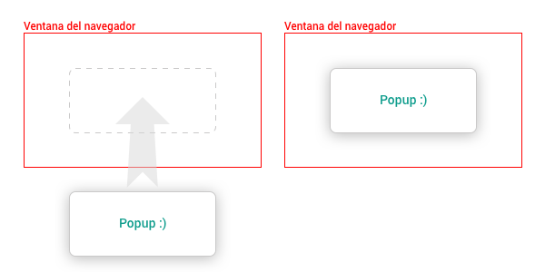
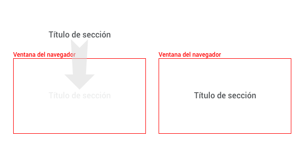

# Animaciones CSS

<!-- TOC START min:4 max:4 link:true update:true -->
- [EJERCICIO 1:](#ejercicio-1)
- [EJERCICIO 2:](#ejercicio-2)
- [EJERCICIO 3:](#ejercicio-3)

<!-- TOC END -->

## Introducción
CSS es un lenguaje de estilo y con él decimos cómo tiene que verse nuestro HTML. Hasta ahora hemos visto algunas de las cosas que podemos hacer con estilos e incluso como aplicarlas cuando se cumplen ciertas condiciones gracias a las mediaqueries. Todavía nos falta el aspecto más vistoso que le da más vida al apartado gráfico: transiciones y animaciones.

## Transiciones
Las transiciones son "transiciones" entre dos estados de un elemento, bueno, entre propiedades de un selector. Por ejemplo, con el `:hover` de un enlace podemos tener un efecto donde aplicamos unos estilos al enlace y otros cuando el usuario ponga el cursor por encima. Por si no lo tenemos en la cabeza es esto:  


Bien, con las transiciones podemos controlar el paso entre dos valores de una propiedad CSS.  
> [Ejemplo en Codepen](https://codepen.io/adalab/pen/baEmxK)

o entre varios valores de varias propiedades:

> [Ejemplo de varias propiedades en Codepen](https://codepen.io/adalab/pen/dJGwPg)

### ¿Cómo se construye una transición?
Las transiciones de especifican con la propiedad `transition` que es un atajo de:
* `transition-property`: la propiedad sobre la que queremos aplicar la transición
* `transition-duration`: la duración de la transición en segundos o milisegundos
* `transition-timing-function`: una función de tiempo para determinar cómo aplicar la transición, hay unas [palabras clave para algunas funciones](https://developer.mozilla.org/en-US/docs/Web/CSS/single-transition-timing-function#Keywords_for_common_timing_functions)
* `transition-delay`: un tiempo de retardo antes de empezar la transición

No hace falta especificarlas todas y podemos usar el atajo o no. En los ejemplos lo usamos con la propiedad, la función de tiempo y la duración de la transición:
```css
.link {
	transition: color ease 1s;
}
```
y definimos transiciones de varias propiedades separándolas por `,`:
```css
.link {
  transition: color ease 1s, border-color ease 1s;
}
```
### Vale, y ¿esta propiedad se coloca en cualquier sitio?
Pues no, pero para empezar vamos a colocarla en el estado inicial del selector cuyas propiedades vamos a animar.
Por ejemplo, si queremos un enlace con una transición de color:
```scss
a {
	color: blue;
	transition: color ease .8s;
	&:hover {
		color: black;
	}
}
```

* * *
#### EJERCICIO 1:

Dado este [botón](https://codepen.io/adalab/pen/XVXGVN?editors=1100):
- Añade transiciones para que el coloreado y el sombreado no sean tan bruscos
- Añade transiciones para modificar alguna propiedad (tamaño, redondeado, color de fuente...)
* * *
Con este tipo de efectos podemos limar pequeños detalles o resolver interacciones más complejas, sólo cambiando clases.

En este [Codepen](https://codepen.io/adalab/pen/goPZep) usamos javascript para que al hacer click en el botón "Menú" se aplique una clase al elemento `.page`, que se elimina al hacer click en la X de "Cerrar".

* * *
#### EJERCICIO 2:

¿Cómo os veis para hacer un botón central que al hacer click haga que "popup" entre despacito desde abajo de la ventana del navegador y se coloque en el centro?


* * *

## Animaciones
Mientras las transiciones nos permiten pasar de un estado a otro, las animaciones nos dejan variar los valores de las propiedades CSS en el tiempo.
Para ello definimos una secuencia de estados y cómo se va a controlar la animación.

Primero definimos unos keyframes con la regla `@keyframes` y dentro definiremos las distintas posiciones de nuestra animación. La primera será al 0% y la última al 100% (en lugar de 0% y 100% podremos usar `from` y `to`):
```css
@keyframes intro {
	from {
		opacity: 0;
		transform: scale(10) rotate(-150deg);
	}
	to {
		opacity: 1;
		transform: scale(1);
	}
}
```
y luego se la aplicamos a nuestro selector con el atajo 'animation' o con sus subpropiedades:
- `animation-delay`: determina el tiempo  hasta que empieza la animación
- `animation-direction`: especifica si la animación mantendrá la dirección, la alternará en cada repetición, o si la resetea al punto inicial
- `animation-duration`: marca el tiempo que durará la animación
- `animation-iteration-count`: dice las veces que se va a repetir la animación
- `animation-name`: especifica el identificador de la animación
- `animation-play-state`: permite pausar una animación
- `animation-timing-function`: funciona igual que con las transiciones
- `animation-fill-mode`: especifica si los valores de la animación se aplicarán al elemento animado una vez termine o antes de empezar

Por ahora vamos a ver como aplicar nuestra animación sencilla:
```css
.hi {
	font-size: 100px;
	color: #3CDBC0;
	animation-name: intro;
	animation-duration: 5s;
	animation-iteration-count: 1;
}
```

[El resultado en Codepen](https://codepen.io/adalab/pen/qpbwwG)

Vamos a probar [una menos... powerpoint](https://codepen.io/adalab/pen/jYWjVj)

Tenéis la documentación completa de las sub propiedades de `animation` en la MDN: [CSS Animations](https://developer.mozilla.org/en-US/docs/Web/CSS/CSS_Animations)

### Ejemplos de animaciones (más o menos curradas)
- [Pure CSS Animated Checkbox](https://codepen.io/north-of-rapture/pen/rWqega?limit=all&page=2&q=css+animation)
- [CSS Animated Hamburger Icon](https://codepen.io/elijahmanor/pen/Igpoe?q=css+animation&limit=all&type=type-pens)
- [CSS Animate](https://codepen.io/mdd/pen/xEuyG?q=css+animation&limit=all&type=type-pens) (Y ha escrito un [post sobre cómo se hace](https://webdesign.tutsplus.com/tutorials/a-beginners-introduction-to-css-animation--cms-21068))
- [CSS Animation Material Design](https://codepen.io/Michiel/pen/EBtga?limit=all&page=3&q=css+animation)
- [CSS Animation with steps()](https://codepen.io/Guilh/pen/yldGp?limit=all&page=4&q=css+animation)
- [Mr JeellyFish pure CSS animation](https://codepen.io/FabioG/pen/QjLreK?q=css+animation&limit=all&type=type-pens)
- [WWDC 2015 CSS](https://codepen.io/donovanh/pen/pvMeeB?q=css+animation&limit=all&type=type-pens)
- [Cloudy Spiral CSS animation](https://codepen.io/hakimel/pen/aIhkf?q=css+animation&limit=all&type=type-pens)

> **NOTA**:  
> Animar es un trabajo en sí mismo y aunque, de entrada, nadie nos va a pedir que seamos animadoras profesionales está bien conocer las posibilidades que nos da CSS para tener un repertorio más amplio de opciones a la hora de desarrollar una web. Otra cosa es que nos guste y CSS es suficientemente potente para hacer locuras.

* * *
#### EJERCICIO 3:  
Vamos a hacer algo más del día a día: partiendo de un contenedor que ocupe el 100% de la pantalla (en alto y ancho) con una imagen de fondo y un título centrado...
Tendremos que hacer que el título tenga una animación que lo haga entrar suavemente desde la parte superior del navegador y quedarse en el centro de su contenedor.


* * *
