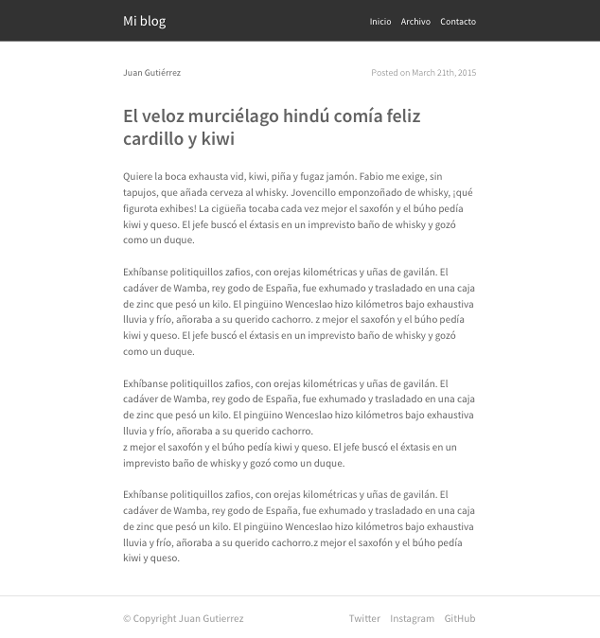
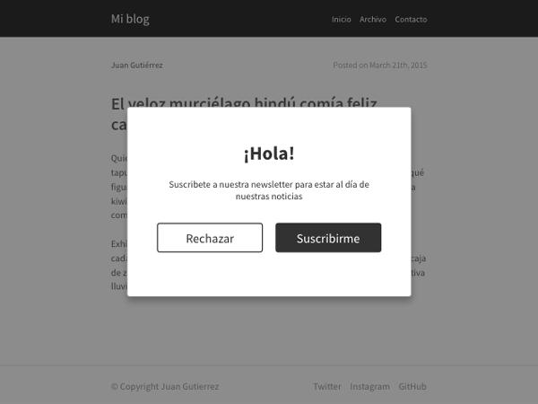

# Flexbox

<!-- TOC START min:2 max:2 link:true update:true -->
- [Introducción](#introduccin)
- [¿Para qué sirve lo que vamos a ver en esta sesión?](#para-qu-sirve-lo-que-vamos-a-ver-en-esta-sesin)
- [¿En qué casos se utiliza?](#en-qu-casos-se-utiliza)
- [Resumen de la sesión](#resumen-de-la-sesin)
- [Recursos externos](#recursos-externos)

<!-- TOC END -->

## Introducción

Durante esta sesión veremos cómo distribuir los elementos en una página usando Flexbox.

Según la MDN, la propiedad Flexible Box, o flexbox, de CSS3 es un modo de diseño que permite colocar los elementos de una página para que se comporten de forma predecible cuando el diseño de la página debe acomodarse a diferentes tamaños de pantalla y diferentes dispositivos.

Hasta que apareció Flexbox la única manera de distribuir elementos en horizontal (por ejemplo: un menú horizontal, o un bloque principal y uno secundario) era calculando el espacio que debe ocupar cada bloque y controlando mucho que ningún elemento se saliese de lo planificado.

Con flexbox podemos disponer de un bloque flexible que de manera natural se ajuste dentro de unos parámetros que le indiquemos.

Vamos a seguir esta guía y a ir planteando unos ejercicios para cada propiedad que veamos: [Guía completa de flexbox](https://css-tricks.com/snippets/css/a-guide-to-flexbox/)

<!--[Guía visual para aprender Flexbox](http://soyfrontend.com/guia-visual-aprender-flexbox-css3/)-->

	NOTA:
	Habrá que ver cómo hacer que uno o varios elementos ocupen el 100% del alto de la ventana del navegador y averiguar cómo encaja en el ejercicio la propiedad ´min-height´

## ¿Para qué sirve lo que vamos a ver en esta sesión?

Flexbox es una herramienta imprescindible en la maquetacion actual y nos permite tener elementos html que se ajusten a las diferentes pantallas de los diferentes dispositivos.

## ¿En qué casos se utiliza?

Pues hay casos muy evidentes, como hacer un pié fijo cuando hay poco contenido, o un panel lateral con una parte fija y otra flexible. Pero también hay otros más simples como un menú horizontal, un listado de iconos de redes sociales o una noticia donde queremos que a veces la imagen vaya arriba o tras el texto.
Básicamente lo podemos/querremos usar en cualquier estructura que se distribuya en vertical u horizontal y sobre la que querramos controlar el espaciado, orden o alineamiento.

## Resumen de la sesión

El objetivo es aprender a montar un contenedor con flexbox y a dominar las diferentes opciones que tenemos de distribuir sus elementos.

* * *
EJERCICIO 1: FLEX y FLEX DIRECTION

1. Crear un contenedor flex de  500px por 500px y con 6 o más elementos.
2. Hacer que se distribuyan en horizontal o vertical
3. Indicar cuál es el eje principal
* * *
EJERCICIO 2: FLEX WRAP

Teniendo una lista de 10 a 15 imágenes de 200x100 px, hacer un bloque flexbox donde las imágenes se distribuyan por el eje horizontal y se vayan apilando uno detrás de otro.
* * *
EJERCICIO 3: JUSTIFY CONTENT y ALIGN ITEMS

1. Hacer un menú horizontal con un contenedor flex de 100px de alto
2. Las opciones de menú serán:
	* Home
	* Proyectos
	* Equipo
	* Blog
	* Contacto
3. Hacer que se distribuyan horizontalmente ocupando todo el espacio disponible, que la primera opción esté a 20px del borde izquierdo, y la última esté a 20px del borde derecho
4. Todos los textos deben aparecer centrados verticalmente en el contenedor de 100px
5. El espacio restante debe usarse para separar las opciones de menú, unas de otras
* * *
EJERCICIO 4: ORDER

1. Hacer un listado de noticias con imagen, título y párrafo de contenido
2. Meterlas en un contenedor flex y hacer que se distribuyan a dos columnas
3. Elegir una noticia, por ejemplo, la última, y ponerla como destacada, en primer lugar y ocupando las dos columnas
* * *
EJERCICIO 5: FLEX/GROW/SHRINK/BASIS

Hacer una página con `<header>`, `<main>` y `<footer>` y hacer que aunque haya poco contenido el footer siempre está abajo de la página y el main ocupe todo el espacio disponible.
Si hubiese mucho contenido el footer debe colocarse tras el main, de forma natural.
* * *
EJERCICIO 6

Convertir la imagen anterior a código usando HTML y CSS y lo que habéis aprendido hoy de Flexbox. Los requisitos son los siguientes:

* Las medidas tienen que ser relativas, es decir, los elementos de la página deben adaptarse al ancho de la ventana del navegador web. Si el tamaño de la ventana aumenta, el tamaño de los elementos debe aumentar.
* El ancho del conjunto entero debe ser del 100% con un ancho máximo de 960px
* Cada bloque debe de crearse con una etiqueta HTML5 (header, footer, aside...) y debe tener un título que esté centrado (como aparece en la imágen). El bloque central (que sería un article), en vez de tener un título, tendrá un párrafo con un texto aleatorio, podéis escribir dentro de él lo que queráis.
* * *
EJERCICIO 7

Convertir la imagen anterior a código usando HTML y CSS y lo que habéis aprendido hoy de Flexbox. Los requisitos son los siguientes:

* En este caso si el tamaño de la ventana aumenta solo aumentará el tamaño del bloque central, el bloque gris de la izquierda y el grupo que compone la puntuación, texto y estrella de la derecha siempre tendrán el mismo tamaño (ejemplo abajo)
* El ancho del conjunto entero debe ser del	 100% con un ancho máximo de 840px
Para el bloque gris de la izquierda debéis buscar una imagen cuadrada y colocarla ahí
* No os preocupeis por el tamaño de cada elemento, lo importante es que el resultado tenga una composición similar
* Para redondear los bordes debéis usar border-radius con unidades en pixel (por ejemplo, border-radius: 5px)

Si tenéis cualquier duda, preguntad.
* * *
EJERCICIO 8

Crear una página con un texto simple centrado que ocupe el 100% de la pantalla hasta un máximo de 600 píxeles. Este texto deberá tener un título, un autor y una fecha de creación organizado de la siguiente forma.

Además deberá tener una cabecera con un fondo que ocupe toda la pantalla y un contenido que ocupe el mismo ancho que el texto. A su vez, tendrá que tener también un footer que se quede pegado en la parte inferior de la página. Cuando haya poco texto se mantendrá ahí y cuando aparezca mucho más texto se irá hacia abajo, siempre al final de la página.

Ejemplo de la página cuando el texto es largo

Ejemplo de la página cuando el texto es corto

Una vez que tengamos esa estructura y una distribución visual similar a la de la imagen crearemos un elemento que se superponga sobre él. Ese elemento tendrá un fondo oscuro transparente y un div en su interior. Ese div entero estará centrado tanto vertical como horizontalmente y contendrá un titular, un texto y un par de botones. El resultado quedaría igual a la siguiente imagen.

En la imágen, es importante observar que la cabecera estará por debajo de la ventana emergente.

Es importante utilizar flexbox para los elementos del header de la página y el footer. Si tenéis cualquier duda, preguntad.
* * *

## Recursos externos

### Teoría para aprender flexbox

[Introducción a flexbox](https://www.youtube.com/watch?v=F-KCncXMPk0)

### Juegos para aprender flexbox

[Flexbox froggy - juego](http://flexboxfroggy.com/#es)

[Flexbox defense - juego (inglés)](http://www.flexboxdefense.com/)

### Página interactiva para aprender flexbox

[Página interactiva para aprender flexbox](http://codepen.io/enxaneta/full/adLPwv/)

### Guía completa de Flexbox (inglés)

[Guía completa de Flexbox](https://css-tricks.com/snippets/css/a-guide-to-flexbox/)
