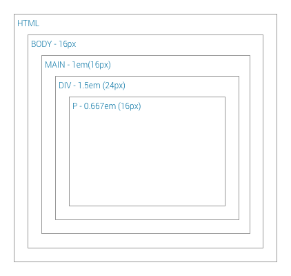

# Publicando nuestra web

## Contenidos

- Diseño flexible
- ¿Qué es responsive?
- Imágenes, media, tipografía (em) flexibles
- Mediaqueries. meta-name=”viewport”. Viewport.
- Max-width, min-width (y height). Width: 100%.
- Mobile first.
- Bonus: vh

## Introducción

Durante esta sesión aprenderemos a usar las media queries para modificar el contenido de nuestra página en función de la disposición de la pantalla, el tipo de dispositivo en el que se va a mostrar o el tamaño de la ventana de visualización de este último.

## ¿Qué es diseño flexible?
Antes de meternos con la maquetación responsive vamos a mirar a lo que podría ser un antecesor: el diseño flexible, o líquido.

Se dice que un diseño es líquido, o más correctamente, que una maquetación es líquida cuando definimos todos los anchos de los contenedores en términos de porcentajes de la vista del navegador, así pueden expandirse y contraerse cuando la ventana del navegador cambie de tamaño.

Muchas webs se maquetaban así cuando el tema de las pantallas y dispositivos no era todavía un problema y cuando empezaron a salir las primeras pantallas diferentes (800x600 y 1024x768) esta maquetación por porcentajes te permitía tener ese margen entre unas dimensiones y otras.

Con el paso del tiempo, hemos visto que el problema ya no se resuelve teniendo algo de margen y a día de hoy tenemos pantallas que van desde los 320px de ancho hasta los 2560x1440. Aquí es donde entra el diseño responsive.

## ¿Qué es responsive?
El responsive, o Responsive Web Design (RWD) es un concepto de desarrollo orientado a que los sitios web se vean y comporten correctamente en todos los dispositivos y pantallas.

Responsive no es solo móvil, tablet y escritorio, también es un navegador que ocupe la mitad de la pantalla por alguna razón (por ejemplo: estamos escribiendo un artículo en nuestor editor de textos y tenemos al lado una web donde consultamos información).

Esto se consigue combinando varios enfoques:
- Maquetaremos ciertas zonas usando porcentajes
- Ciertos elementos se ajustarán al tamaño del contenedor hasta un cierto valor, es decir, se comportan como si tuviesen las medidas por porcentajes pero pudiendo marcar tamaños máximos y mínimos
- Usaremos unidades "flexibles" en ciertos casos, como `em` o `vw` y `vh`. Y claro, el `%`
- Tenemos a nuestra disposición unas expresiones CSS, las mediaqueries, que nos permiten aplicar una serie de reglas cuando en nustro navegador se cumplen una serie de condiciones: ancho, alto, resolución, orientación...
- Veremos qué es el viewport y cómo usarlo

[Curso de Responsive Design](https://www.youtube.com/playlist?list=PLQCgNGUqLK4mW7LxW3jJdRjCnErL5rszl)

## Imágenes, media y tipografía flexibles
### Imágenes
En este entorno Responsive las imágenes y videos tienen su forma de afrontarse y aunque ambos formatos podemos dimensionarlos por porcentajes tenemos varios casos en los que la imágen o el vídeo queda demasiado grande o demasiado pequeño. Para ello tenemos unas propiedades que matizan el `width` (ancho) o el `height` (alto):

* max-width
* min-width
* max-height
* min-height

De esta manera no solo podemos definirle un ancho/alto en porcentages sino marcar unos límites.

Por ejemplo: Quiero que mi imagen se ajuste al 100% del contenedor pero solo hasta un máximo de 900px, controlando de esa manera que se haga demasiado grande:

[Ejemplo de imagen "responsive" en Codepen](https://codepen.io/oneeyedman/pen/XzKdBe)

### Vídeos
Los vídeos son más complicados de controlar porque la etiqueta `<video>`, al contrario que la `` no redimensiona proporcionalmente el video, aunque hay formas de suplirlo ya sea por css o tirando de unas librerías en JS.

### Tipografía
Para el tema de la tipografía hay varias escuelas y formas de afrontarlo según el caso:

* Una es tirar de unidades fijas como los pixels, e indicarle en cada caso qué tamaño de fuente debe tener cada texto. Por ejemplo: en móvil mi téxto básico será de 18px porque la pantalla es más chica pero quiero que se lea mejor, pero en tablet lo bajo a 16px y en escritorio lo vuelvo a poner a 18. Aunque en pantallas muy grandes usaré 20px o 24px.
* Tenemos unas unidades relativas como los `em`

`em`: 1em es el tamaño de fuente del elemento actual (es el ancho de la letra M mayúscula). El tamaño de fuente por defecto que los navegadores usan antes de aplicar CSS es de 16 píxeles, lo que significa que este es el valor asignado por defecto a un elemento (1em). Ojo — los tamaños de fuente de los elementos se heredan de los padres, por lo que si a los padres se les aplica otros tamaños de fuente, la equivalencia en pixel de un em puede complicarse.

[Calculadora de em](https://vasilis.nl/nerd/code/emcalc/)

## Max-width, min-width (y height). Width: 100%.
Estas propiedades que permiten "limitar" anchos y altos se pueden aplicar a casi cualquier contenedor (que admitan dimensiones) de manera que podamos tener elementos que se dimensionen a base de porcentajes pero sobre los que tengamos un poco de control para que en determinados escenarios no se hagan demasiado pequeños ni demasiado grandes.

Ejemplos de esto son:

* La imagen de una noticia que en móvil ocupa el 100% del ancho de la página pero que cuando llega a un cierto ancho se queda a la izquierda del texto de la noticia y ya no crece más.
* 

## Mobile first.
## Bonus: vh

## ¿En qué casos se utiliza?

{{usecase_info}}

## Recursos externos

### Curso de Responsive Design

[Curso de Responsive Design](https://www.youtube.com/playlist?list=PLQCgNGUqLK4mW7LxW3jJdRjCnErL5rszl)

### Media queries

[CSS: Media queries (video)](https://www.youtube.com/watch?v=y6zYUe7MdLQ)

### Por qué mobile first es importante hoy en día

[Mobile first es importante hoy](https://www.youtube.com/watch?v=SEXm5OM-U3s)

### Cómo aplicar mobile first y responsive design

[Cómo aplicar el mobile first y el responsive design](https://www.youtube.com/watch?v=KjHRa_Qzus8&index=8&list=PL6hPvfzEEMDaKYAabXoDL7A-fZcwxvIqe)

## Resumen de la sesión

{{summary_info}}

### Ejercicios

### Ejercicios de refuerzo de Media queries

Si alguien quiere, puede realizar los siguientes ejercicios para practicar con media queries.

[Ejercicios de refuerzo media query](https://docs.google.com/document/d/1Xco0LqASXIQS6dUIxhuU5loG2CyWYB8gRBaEA4nqR7k/edit)
