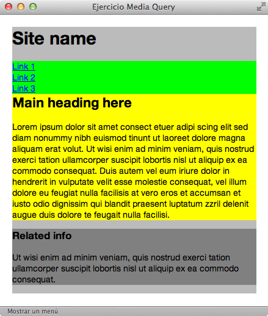
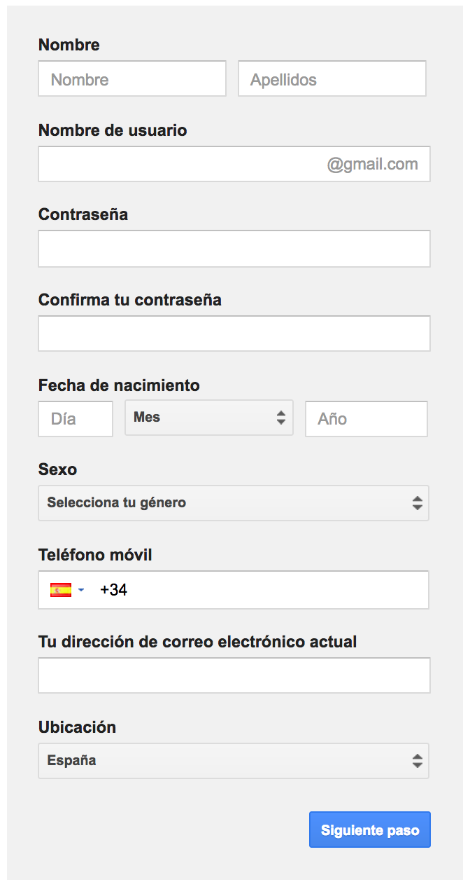

# Sesión de repaso 2

Vamos a hacer cada uno de estos ejercicios en parejas, así que buscad una compañera para trabajar. Idos turnando en cada apartado del ejercicio, de forma que no sea siempre la misma quien escribe en el ordenador.

Antes de empezar, tenéis que crear un nuevo repositorio en GitHub (en la cuenta de cualquiera de las dos), con el nombre `s1` y el nombre del ejercicio. Una vez creado, lo clonaremos en nuestro ordenador y en la carpeta creada al clonarlo empezaremos a trabajar en el ejercicio.

Por cada apartado completado del ejercicio, y antes de cambiar quien teclea en la pareja, debéis hacer un commit describiendo los cambios nuevos que habéis introducido, en inglés. Al finalizar un ejercicio completo, subiremos el resultado a GitHub y lo publicaremos en `master` con GitHub Pages.

## Ejercicio de repaso de flexbox y mediaqueries

Dados los siguientes diseños, maquetar la web aplicando las mediaqueries necesarias.

Aspecto de la web a pantalla completa

Aspecto de la web en una pantalla de 1000px

Aspecto de la web en una pantalla de 480px

## Ejercicio de repaso de formularios

Crea un formulario similar al de la imagen, que es el de registro de GMail.

Modifica el formulario anterior para que se hagan las siguientes validaciones:

- Todos los campos excepto sexo son obligatorios
- La dirección de correo actual debe ser una dirección de correo válida
- El teléfono debe ser un número de teléfono válido en España (PISTA: mirad cómo usar el atributto `pattern`)
- Día y año (de la fecha de nacimiento) deben ser numéricos

## Pequeño repaso de 'em'

`em` es una unidad que depende del tamaño de fuente de su contenedor, ya sea porque se especifica o porque se hereda de otro.
Suponiendo [este ejemplo](https://codepen.io/adalab/pen/MOEWmP) donde ya está ajustada la cabecera, el footer, y la proporción que queremos de título y texto en el post, hay que hacer los ajustes necesarios solo en `.main` para que nuestro post se adecúe a mobile, tablet, desktop y desktop full.

Para ello hemos preparado una "pista" para la versión mobile en la línea 97 del CSS. Quedaría ajustar el tamaño de la fuente de `.main` para las sucesivas resoluciones (ya hay preparadas unas mediaqueries donde poner los tamaños de letra).
