# Trabajo colaborativo en GIT
<!-- TOC depthFrom:4 depthTo:4 updateOnSave:true withLinks:true -->

- [EJERCICIO 1](#ejercicio-1)
- [EJERCICIO 2](#ejercicio-2)
- [EJERCICIO 3](#ejercicio-3)
- [EJERCICIO 4](#ejercicio-4)

<!-- /TOC -->

## Introducción
Normalmente vamos a tener una versión de nuestro proyecto sobre la que vamos a querer aplicar modificaciones o ampliar características. Si trabajamos con git como hasta ahora, nuestro proyecto no se podrá tocar hasta que dichas modificaciones terminen. Para solucionar esta situación vamos a ver cómo trabajar con las ramas para que nos permitan afrontar desarrollos paralelos como nuevas características, tareas de mantenimiento o integrar un nuevo diseño.

## ¿Para qué sirve lo que vamos a ver en esta sesión?
Una característica de git (también de otros sistema de control de versiones) es la posibilidad de ramificar el proyecto, **permitiendo tener una versión principal y versiones paralelas donde aplicar nuevas secciones o características, o probar funcionalidades**. De esta manera si hay que hacer un pequeño cambio no tenemos que esperar a que nuestra nueva funcionalidad o sección esté acabada; tendremos varias versiones, ramas, una donde mantener nuestro proyecto y colocar estos pequeños ajustes, y otra(s) donde realizar trabajos paralelos.

## ¿En qué casos se utiliza?

Si tenemos en cuenta que, por defecto, nuestro repositorio va sobre una rama llamada "master", entonces podemos decir que siempre trabajamos en ramas :)

Fuera de la anécdota, estos son algunos casos donde usar ramas.

Tenemos una versión de nuestro proyecto y:

* Queremos tener un lugar donde realizar pequeños mantenimientos del proyecto como corrección de erratas o cambios rápidos
* Queremos desarrollar un nuevo diseño que aplicaremos cuando esté terminado
* Queremos desarrollar una nueva funcionalidad y no sabemos si al final la aplicaremos o no
* Queremos mantener varias versiones de nuestro proyecto, la de desarrollo, la de producción y un histórico versiones completas
* Varios equipos van a desarrollar diferentes funcionalidades sobre nuestro proyecto

## Flujo de trabajo con ramas
Vale, y ahora ¿cómo trabajamos con las ramas? ¿Hacemos las que necesitemos? ¿Las llamamos como queramos? ¿Sin orden? No, claro, que no: sin orden solo hay caos.

Vamos a tener dos tipos de ramas, las de largo recorrido o permanentes y las de corta duración o puntuales.

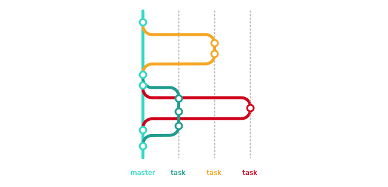

### Ramas permanentes
Los equipos suelen tener una o dos ramas permanentes, una donde está la versión estable de nuestro proyecto (suele ser la rama `master`), la que vamos a subir a nuestro servidor (o a GitHub Pages) y una intermedia donde ir fusionando los diferentes cambios/mejoras (nombres comunes para esta rama son `dev`, `develop`...). Esta segunda rama no siempre tiene código estable, pero **solo cuando lo tiene la fusionaremos hacia `master`**.


En el curso vamos a tener dos ramas permanentes: `master` y `dev`. Si se trata de un ejercicio pequeño podemos usar solo `master`.

### Ramas puntuales
Cuando tenemos una tarea nueva (modificar o crear contenido, por ejemplo) crearemos una nueva rama solo para dicha tarea. Trabajaremos sobre ella con normalidad, haciendo los commits necesarios y subiéndola a su correspondiente rama remota como hemos venido haciendo hasta ahora con `master`.

Recordad que usaremos `git push origin nombre-de-la-rama`

Una vez terminada la tarea y comprobado que todo funciona correctamente ya está lista para ser fusionada con `dev`. Pero no lo haremos, todavía.


### Pull Request y revisión de código
Aunque hay diferentes formas de trabajo con ramas en el curso vamos a ver una muy común en las empresas: el equipo que se encarga de una tarea, crea la rama, ejecuta la tarea y la sube a la rama remota, pero no la fusiona: crea un **Pull Request**. De esta forma un equipo o algún miembro del equipo se encarga de revisar el código y dar el visto bueno a la fusión.

> A partir de este momento ya no vamos a hacer `$ git merge` desde la consola (salvo en un caso que veremos más adelante)

La mecánica del Pull Request no es propia de git sino de quién da el servicio de git. En este caso GitHub tiene su propio sistema para gestionar los Pull Requests.

### Code review
La revisión del código no es un asunto menor sino de los más importantes. Aquí no buscamos decir Ok y a correr, no. Aquí es donde tenemos la oportunidad de, con ojos frescos, revisar el código generado por nuestro compañeros para asegurar unos mínimos de compatibilidad, homogeneidad y calidad.

Cuando creamos un PR (o Pull Request) solemos asignar a alguien que será responsable de revisar nuestro código, un **reviewer**. 

Un problema no menor que tenemos en el sector es que cuando nos ponemos a programar nos cuesta detectar una serie de fallos (de código o de estilo) porque estamos centrados en resolver una tarea. Estas revisiones de código permiten compensar eso y asegurar que todos trabajamos a una. Quién revise nuestro código va a poder **mirar y comentar**, en este caso desde GitHub, de manera que si algo no está claro se pueda detectar y hablar en el momento.


### Vamos a poner todo esto en contexto: Flujo de trabajo
Podríamos decir que a partir de este momento `dev` va a ser nuestra rama máster de desarrollo, y `master` será donde tendremos el código listo para entregar.

Vamos a verlo con un ejemplo:
**Web de transportes**
En nuestra empresa hay un proyecto de una web de transportes, con sus ramas `master` y `dev`. Nuestro cliente nos pide una serie de cambios (a estas peticiones se les suele llamar *tickets*):

- **Ticket 34**: Añadir Facebook Messenger como método de contacto con la empresa de transportes
- **Ticket 35**: Añadir sombras a los botones de hacer login y de guardar rutas favoritas
- **Ticket 43**: El color de los enlaces en la página de ayuda debe ser del rojo corporativo pero es morado

En nuestro equipo nos organizaremos de la siguiente manera: Desde `dev` creamos nuevas ramas que se llamarán `ticket/34`, `ticket/35`y `ticket/43`, de manera que podamos desarrollar esas funcionalidades por separado.

Si en lugar de usar un servicio de tickets nuestro cliente usase los issues de GitHub podríamos llamar a las ramas `issue/{número del issue}`.

Hay diferentes formas de nombrar las ramas, al igual que los commits, lo haremos en inglés y con un nombre descriptivo o que identifique la tarea. 

> No hay una convención de nombrado estándar pero sí que existen muchas propuestas, podéis buscar y usar una o buscar vuestro propio sistema. Si entráis en un equipo nuevo lo normal es que ya tengan un sistema de nombrado de ramas, si no, es súper buen momento para proponer al equipo tener uno que se adapte a vuestro sistema de trabajo.

Ahora ya podemos ponernos a trabajar en nuestras tareas... Parece que la 43 es un error nuestro mientras que la 34 y 35 son funcionalidades nuevas. ¡Empecemos por ella!

Cambiamos a nuestra rama `ticket/43` y resolvemos el problema (esta era fácil). Ahora nos creamos nuestra **pull request** contra `dev` y pedimos que una o varias compañeras la revisen.

En esta PR vamos a incluir la información necesaria para que la persona encargada de la revisión entienda que había que hacer y por qué se ha resuelto de esta manera.

Quien toma el papel de revisora tiene que mirar nuestro código y no solo ver que funciona como debe funcionar sino que, además, cumple con los mínimos que haya marcado el equipo de desarrollo.

¿Cómo hace esto? 

1. Pues primero leyendo la PR donde debería haber suficiente información para entender qué había que hacer y cómo se ha hecho.
1. En la propia PR un espacio para revisar qué cambios se han hecho en el código y poder añadir comentarios, aceptar o rechazar la PR...
1. Muy posiblemente quien revise tenga que pasarse a la rama y comprobar que el funcionamiento es el correcto

### La Pull Request del ejemplo, paso a paso
Tenemos que recordar que las PR no dependen de GIT sino de la plataforma que nos ofrezca el alojamiento de nuestros proyectos usando GIT. En este caso, **GitHub**.

En la home de nuestro proyecto tenemos una pestaña para gestionar las Pull Requests, en esa pestaña tendremos un botón para crear una nueva, un listado de las creadas y, si hemos hecho push de una rama, un modulito resaltado en amarillo para crear una PR directamente desde esa rama. En el ejemplo vamos a usar el botón de "**New pull request**".

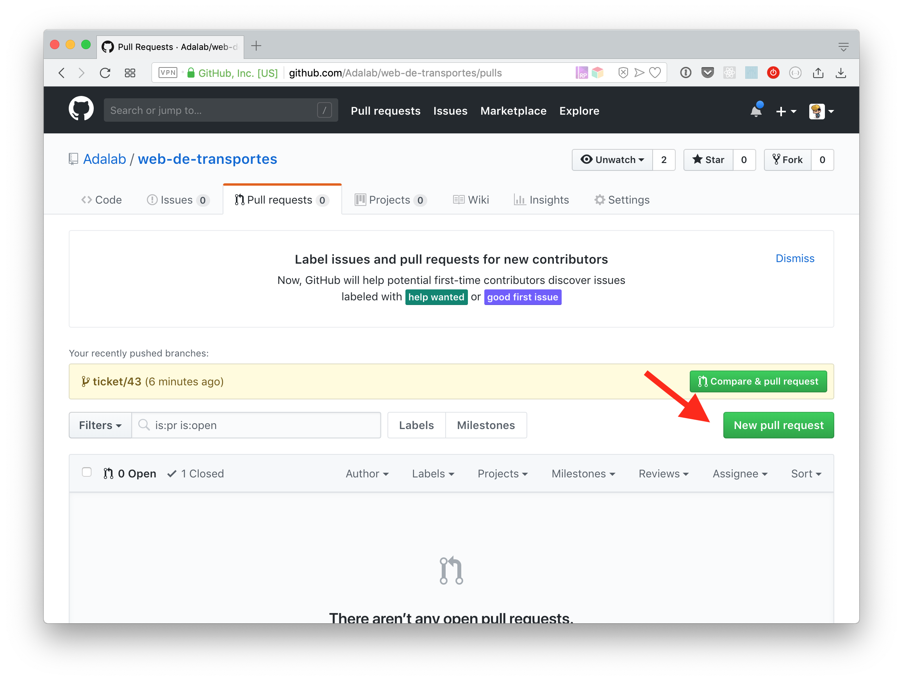

Hay que definir desde qué rama a qué rama va a ir nuestra PR, en este caso de `ticket/43` a `dev`.

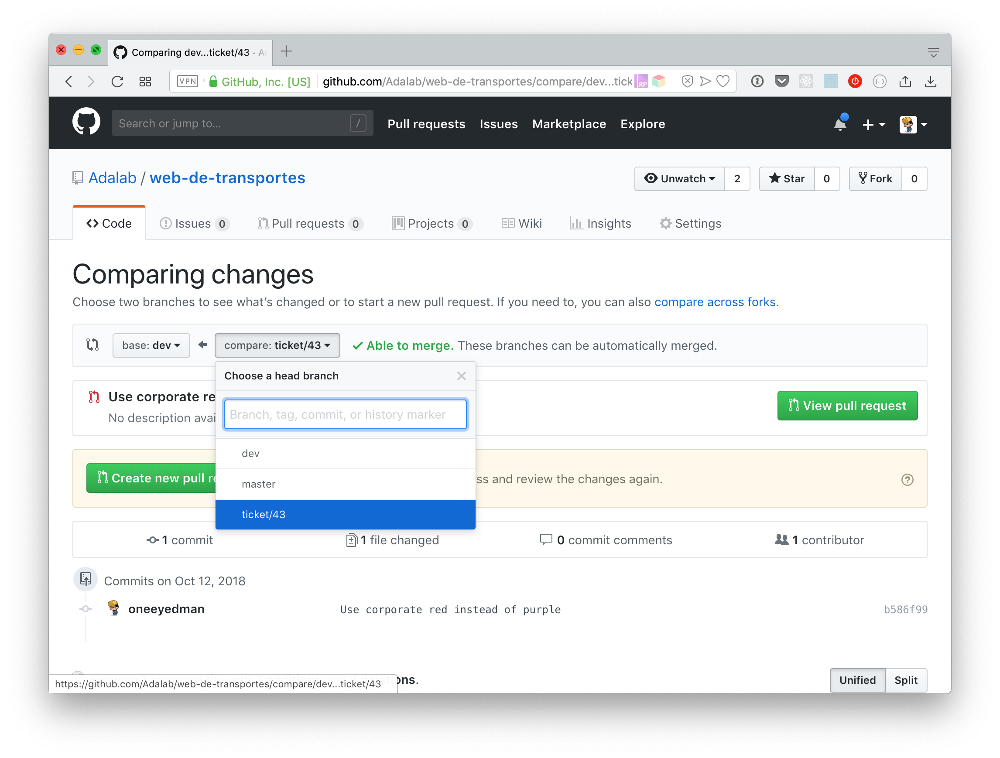

Y ahora, a rellenarla y seleccionar quién va a revisarla. Luego pulsaremos "**Create pull request**".
> El ejemplo es muy sencillo pero recordad que podemos escribir tranquilas el texto que necesitemos en nuestra PR porque no nos cobran por palabra)

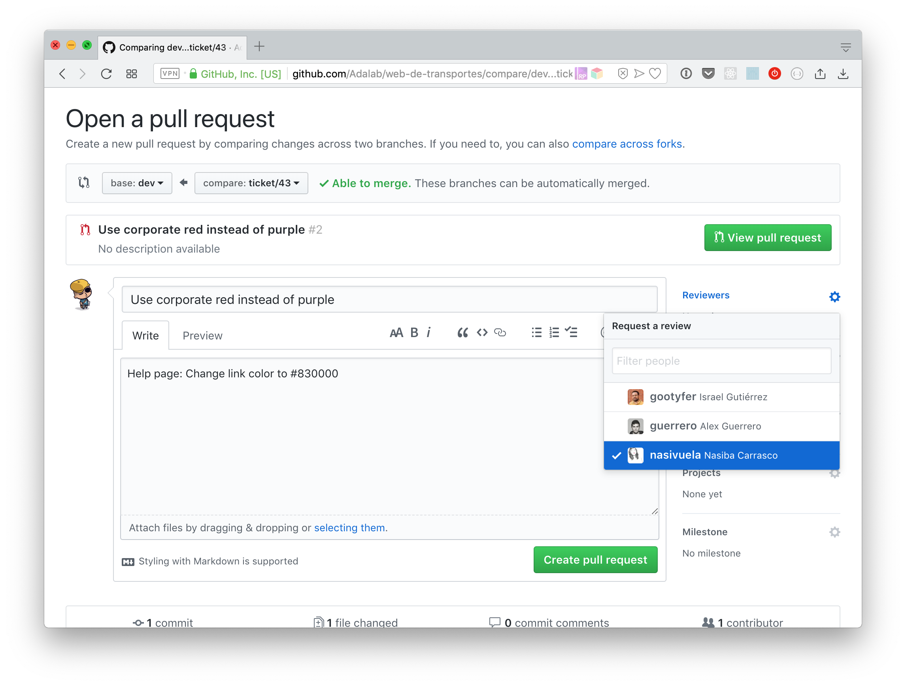

Dentro de la PR hay una pestaña que nos deja ver desde web los cambios que se han hecho (rojo para los borrados, verde para los añadidos 😉). También nos indica si las dos ramas se pueden mezclar sin conflictos 😉😉.

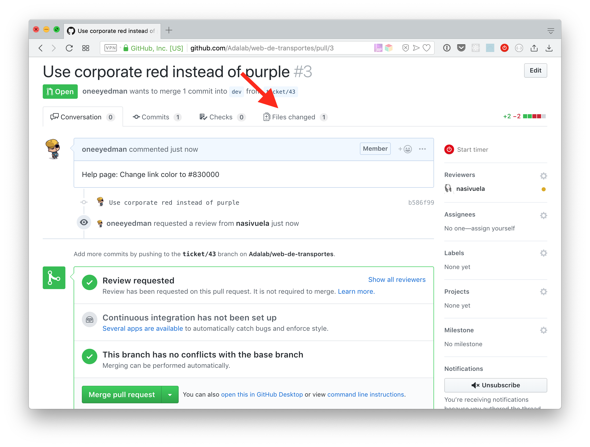

Además podremos seleccionar una línea en concreto para comentarla y/o empezar una revisión.

> Podemos añadir comentarios sueltos o agruparlos en una revisión que "terminará" con un comentario general y tres posibles estados: Comentario general, aprobada o solicta cambios.

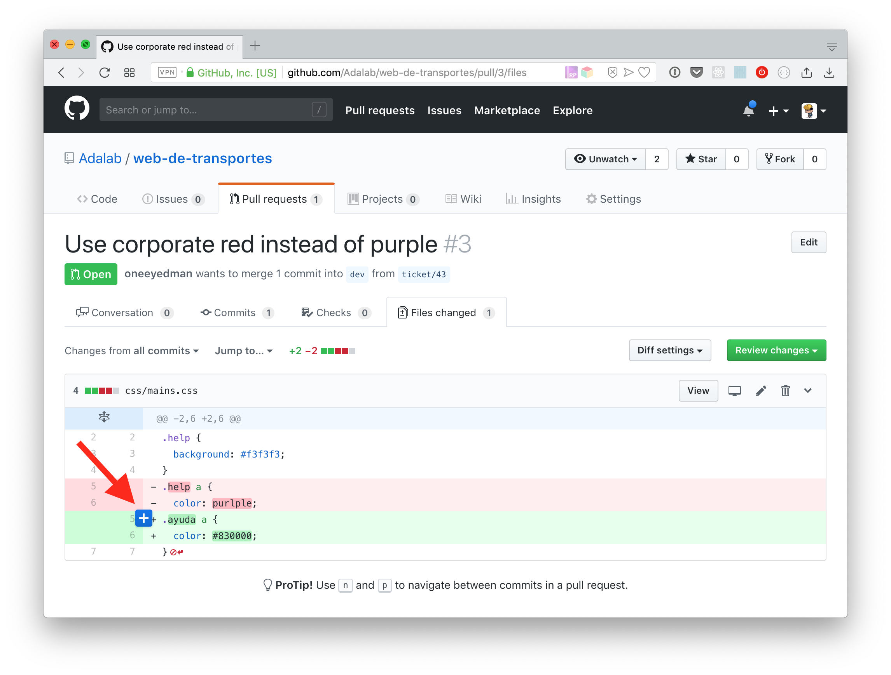

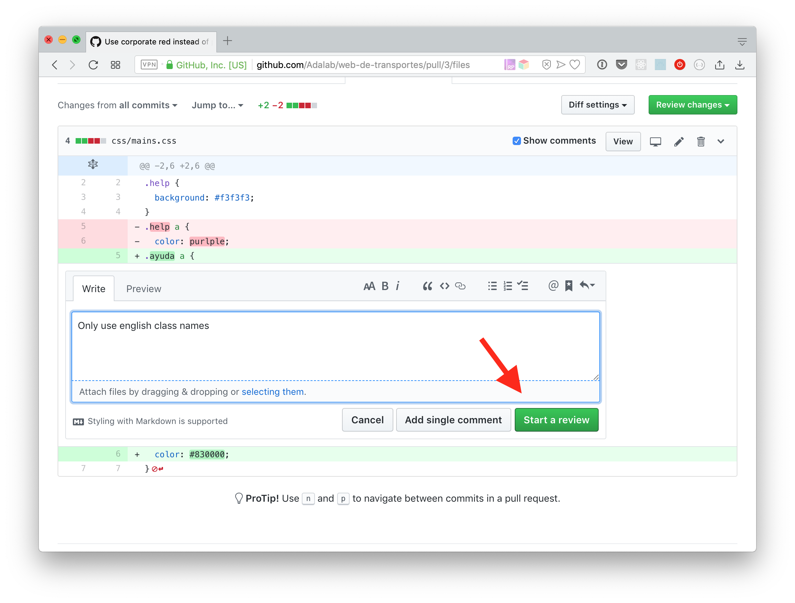

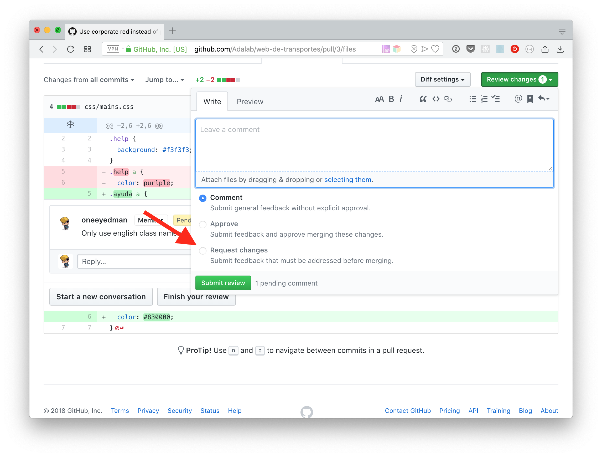

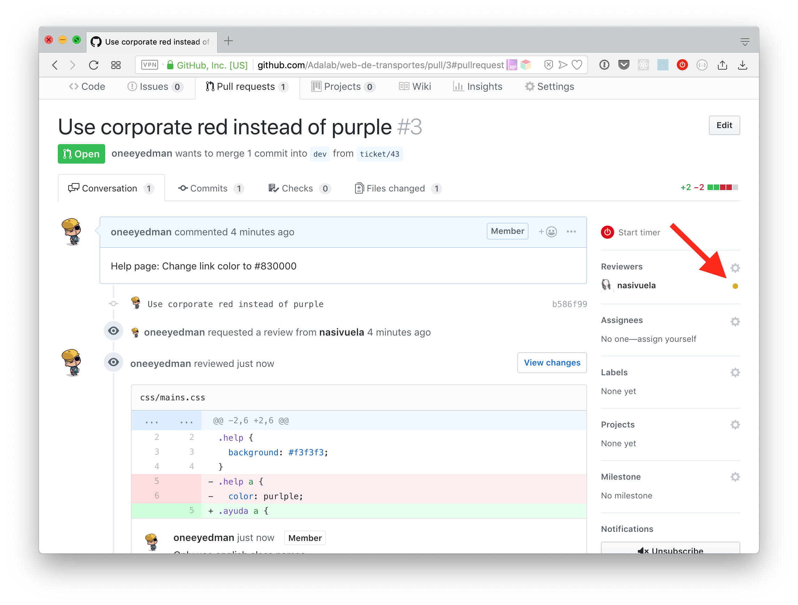

**Pero si tenemos a quien ha hecho el trabajo en la mesa de al lado, ¿de verdad hay que rellenar todo esto?**

Sí. Todo el sistema del control de versiones es un registro exacto de nuestro trabajo y aunque nos acabemos levantando a proponer o discutir el código debemos dejarlo por escrito porque dentro de 3 meses nadie se acuerda lo que se habló en la mesa tres. O quizás el equipo que venga después quiere saber por qué se hizo tal o tal cosa.


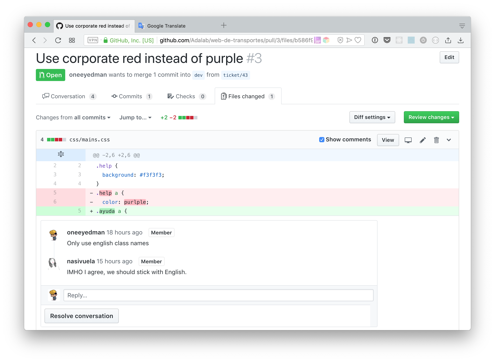

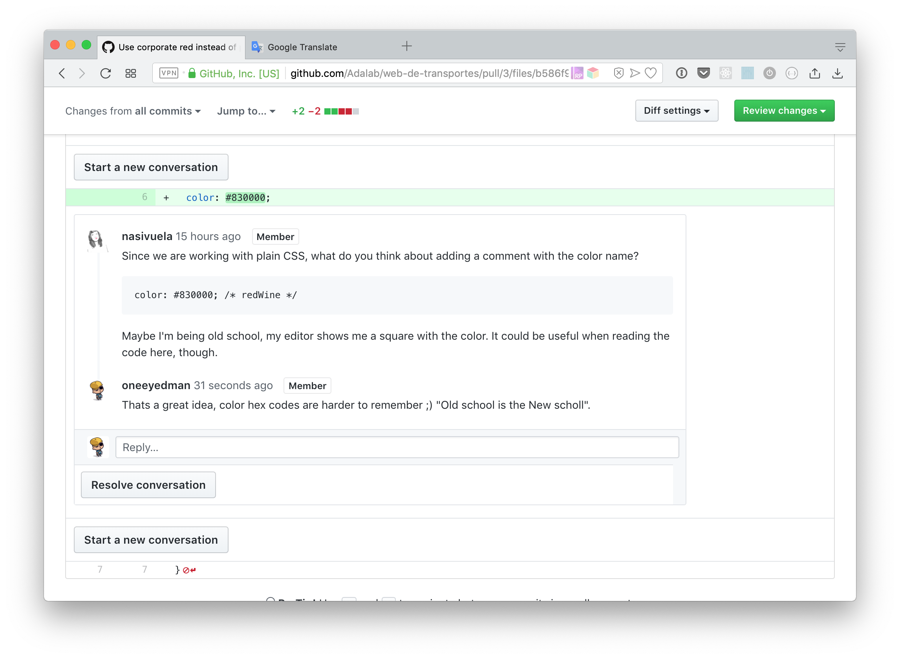


### Los conflictos

A estas alturas ya habremos solucionado alguno que otro. Recordemos que los conflictos suceden porque se han tocado partes iguales de un archivo y el algoritmo de Git no sabe cómo mezclarlo automáticamente así que nos muestra las opciones para que decidamos nosotros.

En este flujo de trabajo sabremos si hay conflictos cuando creemos el PR.

Siguiendo con el ejemplo (PR de `ticket/43` a `dev`) si al crear el PR nos avisa de que hay conflictos procederemos de la siguiente forma:

1. Salta el conflicto la crear el PR de `ticket/43` a `dev`
1. Nos vamos a nuestro terminal y nos aseguramos de tener las últimas versiones de ambas ramas
1. Invirtiendo el orden nos traemos `dev` a `ticket/43`: Cambiamos a `ticket/43` y lanzamos un `$ git merge dev` 
1. Solucionamos los conflictos como haríamos normalmente
1. Hacemos un push de `ticket/43`

Esto actualizará automáticamente nuestro PR y ahora ya sí que podremos irnos a GitHub y ejecutar nuestro PR con éxito :)


Vamos a hacer unas Pull Request con revisión de código, ¿o qué?

* * *
Partimos de una base, html y css:

**index.html**
```html
<!DOCTYPE html>
<html lang="en">
	<head>
		<meta charset="UTF-8">
		<meta name="viewport" content="width=device-width, initial-scale=1.0">
		<link rel="stylesheet" href="main.css">
		<title>Face time!</title>
	</head>
	<body>
		<div class="page">
			<div class="head">
				<div class="face">:|</div>
			</div>
		</div>		
	</body>
</html>
```

**main.css**
```css
.head {
  background: #fc0;
  height: 100px;
  position: relative;
  width: 100px;
}
.face {
  font-family: 'courier new', serif;
  font-size: 2.5em;
  font-weight: bold;
  left: 50%;
  position: absolute;
  top: 50%;
  transform: translate(-50%, -60%) rotate(90deg);
}
```

Primero hay que crear el repositorio con estos dos archivos, dar permisos a nuestra compañera y crear las ramas `master` y `dev`.

A continuación hay un listado de ejercicios/tickets que habrá que ir resolviendo. Usaremos lo que hemos visto de PR pasando a `dev` cada tarea una vez completada. Cuando estén las 3 primeras en `dev`, haremos una subida a `master`, tb por pull request.

> Si os queréis animar a hacer los tickets 1 y 2 a la vez, cada miembro de la pareja puede ponerse con uno.

****

<a id="markdown-ejercicio-1" name="ejercicio-1"></a>
#### EJERCICIO 1

**Ticket #1: Centrar al careto**

Este señor está como apartado, en una esquina... eso no puede ser, debería estar centrado vertical y horizontalmente en la pantalla.

* * *

<a id="markdown-ejercicio-2" name="ejercicio-2"></a>
#### EJERCICIO 2

**Ticket #2: Cara redonda**

Un careto.. ¿es un careto si no es redondo?. Hay que redondear esa cara para que sea un círculo perfecto.

* * *

<a id="markdown-ejercicio-3" name="ejercicio-3"></a>
#### EJERCICIO 3

**Ticket #3: Cara Sonriente**

¿No está un poco serio? Hagamos que sonría un poco. 

* * *

<a id="markdown-ejercicio-4" name="ejercicio-4"></a>
#### EJERCICIO 4

**Ticket #4: Añadir funcionalidad para que guiñe**

Sería genial si al hacer click el careto guiñase un ojo. Hay que tener en cuenta que al dejar de hacer hover sobre el careto tiene que volver a la posición inicial.

* * *

## Recursos externos

- [Ayuda de GitHub sobre los Pull Requests (Inglés)](https://help.github.com/articles/about-pull-requests/)
- [Creando un pull request en GitHub (Inglés)](https://help.github.com/articles/creating-a-pull-request/)
- [6.2 GitHub - Participando en Proyectos](https://git-scm.com/book/es/v2/GitHub-Participando-en-Proyectos)
- [Git feature branch workflow - Atlassian (Inglés)](https://www.atlassian.com/git/tutorials/comparing-workflows/feature-branch-workflow)
