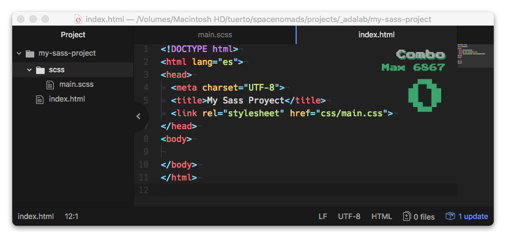
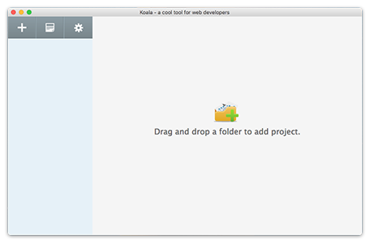
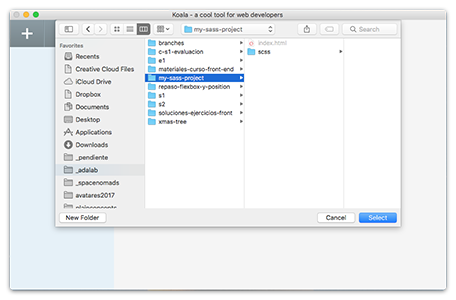
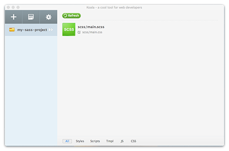
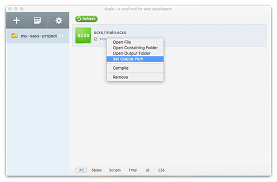
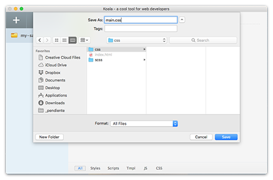
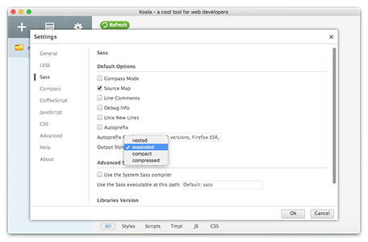

# Sass

## Contenidos

- Qué es preprocesador CSS
- Herramientas de configuración (koala o terminal)
- Básico: variables e imports.
- Variables en Sass
- Nested rules en SASS
- Media queries y el &.
- Estructura de un proyecto SASS típico y como dividir archivos usando `@import`

## Introducción
Con CSS podemos personalizar al pixel el aspecto de nuestra página y como hemos visto tiene una serie de reglas y de formas de hacer todo esto. Sin embargo el sector ha ido madurando y nos encontramos con que necesitaríamos poder trabajar con las hojas de estilos de una manera más ágil, permitiendo el uso de variables, pudiendo dividir los archivos en bloques más pequeños, pudiendo crear bloques de estilos que se repitan o incluso pequeñas funciones simples. Esto es posible con los preprocesadores CSS.

## ¿Qué es un preprocesador CSS?
Un preprocesador CSS es un lenguaje parecido al CSS pero que nos permite tener acceso a funcionalidades que no tiene el css y, tras el procesado, generar un CSS válido.

De esta manera ya no trabajaremos directamente el css sino con este preprocesador que, automáticamente, generará nuestros CSS finales.

Actualmente hay varios preprocesadores, realmente lo que los diferencia son las sintaxis de cada uno pero vienen a hacer un poco lo mismo. Los preprocesadores CSS más famosos son:

* [SASS (el que vamos a ver en Adalab)](http://sass-lang.com)
* [LESS](http://lesscss.org)
* [Stylus](http://learnboost.github.io/stylus/)

Nosotros vamos a usar SASS, concretamente SCSS, que es la sintaxis nueva :)

## Vale, ¿y esto cómo funciona?
Pues esto se instala y se ejecuta por terminal, pero para no sufrir vamos a empezar usando una aplicación, [Koala](http://koala-app.com), que se va a encargar de procesar nuestro archivo de SCSS y a generar los CSS correspondientes.

Luego, `live server`, se ocupará de recargar el navegador cuando el css haya sido generado.

### Koala
Koala es una aplicación de multiplatadorma (linux, mac y windows) que se encarga de procesar nuestros archivos SASS y generar los CSS finales.

  
Un proyecto de ejemplo tendría nuestro css enlazado desde el html como siempre pero esta vez partiríamos de la carpeta `scss`, con un `main.scss` dentro (por ejemplo).



Entonces, desde la aplicación Koala añadimos nuestr carpeta de proyecto  
  
  
Y el programa nos detecta los archivos procesables, en este caso `main.scss` y nos propone una ruta donde generarlo, normalmente en la misma carpeta. Nosotros lo vamos a querer en otra porque estos son nuestros archivos de trabajo y cuando luego queramos entregarlos nos interesará que no estén mezclados.  
  
Con clic derecho seleccionamos dónde queremos que se coloque el css procesado, por ejemplo en nuestra carpeta `css`, y lo llamaremos con su nombre correcto, en este caso `main.css`:  
  
  
Con esto ya estaría aunque podemos tocar alguna cosa más, como el estilo de procesado. Hay 4: nested, expanded, compact, compressed. Por ahora usaremos `expanded` y ya habrá tiempo de ver los otros [estilos de procesado](http://sass-lang.com/documentation/file.SASS_REFERENCE.html#Output_Style)
  

Ahora ya tenemos listo nuestro proyecto. Cada vez que guardemos los cambios en nuestro `main.scss` se generará un nuevo `main.css` y **live server** se encargará de recargar el navegador.

### Me estás liando, SASS o SCSS?
El preprocesador CSS que vamos a usar se llama SASS (Syntactically Awesome StyleSheets) pero tiene dos sintaxis, SASS y SCSS. Usaremos SCSS porque es más parecida a CSS y no depende tantísimo de estar todo bien tabulado ya que usa las mismas llaves a las que estamos acostumbrados ya. Así que diremos `sass` pero usaremos `scss` ;)

## ¿Y qué puedo hacer con SASS/SCSS?
Maravillas, con SASS se pueden hacer maravillas.

Bueno, se pueden hacer muchas cosas, hoy vamos a ver las variables, como se anida, el símbolo '&' y las media queries, imports y mixins/funciones.

Vamos a ello:

### Variables
Se usan muy parecido a JavaScript, pero precedidas por el símbolo '$' y se asignan con los `:`  
```scss
$colorLink: blue;
```

Ahora podríamos hacer algo como:
```scss
$color_link: blue;

a {
	color: $color_link;
}
```
El uso de variables nos da una serie de ventajas como el poder definir al principio del documento todas nuestras variables y si una vez avanzados, o terminados, nuestros estilos queremos cambiar algún valor pues se cambia el valor de la variable que toque y se vuelve a generar el CSS.

¿Qué podemos usar como variables? Lo que queramos.
```scss
$headerHeight: 100px;
$fontText: 'Roboto', arial, sans-serif;
$pathImages: '../images/';

body {
	font: 16px $fontText;
}
.header {
	background: url($pathImages + 'imagen.png') left top no-repeat;
	height: $headerHeight;
}
```
¡Vamos a ponerlo en práctica!
***
EJERCICIO 1:  
En el siguiente [codepen](https://codepen.io/adalab/pen/aVrxYY) tenemos un ejemplo en css que vamos a reescribir a scss y modificar un poco.
1. Lo primero es configurarlo para usar SCSS: en la rueda de CSS, desplegar las opciones y elegir SCSS como preprocesador
2. Convertir a variables los valores de las líneas indicadas
3. Hacer los siguientes cambios solo tocando la variables:
	1. Color del texto de `#414141` a `#010101`;
	2. Tamaño de fuente de la página a `18px`
	3. El margen de `.wrapper` a `0 60px`
	4. Fondo de header y footer a `yellow`
	5. Alto de header y footer a `50px`
	6. Fondo de `.main` a `cyan`
***
> **Cuándo hacemos variables y cuánto no?**  
> Quizás el primer impulso es empezar a crear variables como si no hubiera mañana pero el truco está en ver qué valores reutilizamos (misma altura para diferentes elementos, algunos márgenes, colores) y empezar creando solo esas.

> **Sobre los colores**
> Lo ideal es usar variables que indiquen el tipo de elemento al que se va a aplicar un color y no tanto el color en si: Es mejor `$colorLink` en lugar de variables tipo `$colorBlue` que tarde o temprano acaban valiendo un color diferente y va a desconcertar a quien coja el proyecto después. Aunque hay un término médio: definimos nuestros colores como el color que son y asignamos nuesta variable a otra variable que indique el elemento donde se va a usar:

```scss
$colorBlue: blue;
$colorDarkRed: #800;

$colorLink: $colorDarkRed;

a {
	color: $colorLink;
}
```
De esta manera tenemos un poco lo mejor de dos mundos.

### Nesting o anidado

### El símbolo &
### Mediaqueries
### imports y cómo organizar nuestro proyecto
### Mixins y funciones


## Contenido

## ¿Qué es Sass?

- Sass es un CSS vitaminado, ¿y qué significa que está vitaminado? que tendremos herramientas avanzadas para trabajar en CSS como variables (`$light-green` en vez de `#62BA35`), funciones como `darken` o `percentage`, importar otros archivos Sass para unificarlos todos en uno (mejor carga, más fácil de enlazar, etc).

## ¿Cómo funciona Sass?

- ¿Pero cómo funciona esto? Creamos un archivo Sass, ejecutamos un programa o un código que nos lo convierta a CSS y ese CSS generado será el que utilicemos.
- Hay mil formas de convertir Sass a CSS, usando un comando del terminal, código escrito en JavaScript, plugins de nuestro editor...En nuestro caso usaremos una aplicación llamada Koala para que lo haga por nosotros cada vez que guardemos el archivo.
- ¿Y podemos meter sass directamente en nuestras páginas? En realidad no, lo que haremos será crear código con Sass para convertirlo a CSS y ese CSS generado será el que enlacemos en nuestra página.
- Hoy en día, en muchas de las empresas punteras, no se usa CSS sino que se suele usar herramientas como Sass ya que facilita mucho el trabajo con el código.
- ¿Qué tenemos que hacer para empezar a trabajar con Sass? Muy simple, cambiar la extensión del archivo de `.css` a `.scss` y ya sería un archivo Sass. A partir de ahí, podemos ir metiendo variable de forma gradual.
- En esta clase vamos a ver dos utilidades de Sass, variables e imports y cómo usar ambas para estructurar nuestro código:
  - Variables en Sass
      - Iguales que en JavaScript, se escriben siempre precedidas por un símbolo de dolar `$` y se asignan mediante dos puntos.
      - Son muy útiles para colores, medidas, nombres de fuentes, etc. Importante pensar en abstracción (`$primary-color` en vez de `$blue`)
      - Crearemos
  - Imports
      - Como su nombre indica, permiten importar variables desde otro archivo. se usan con `@import` y la ruta del archivo CSS o Sass que queramos importar (se pueden importar ambos)
      - Si ponemos un archivo con un guión bajo delante Sass no lo procesará para convertirlo a CSS. La idea es que todos los nombres de archivos que vayamos a importar los escribamos con un guión bajo delante. Estos archivos a menudo se suelen llamar _partials_. Porque son partes del código final.
      - Es importante saber que el orden de los imports es importante y que tal como se carguen será como se importen y como se ejecuten para convertirse a CSS
  - Reglas anidadas
  - Estructura
      - Dividimos en:
          - configuración
          - estilos generales
          - tipografía
          - componentes
              - boton
              - media
          - layouts
              - header
              - footer
          - helpers
      - Importante la cascada de CSS. Si tenemos estilos que van abajo, estos sobrescribirán a los que aparezcan más arriba si tienen la misma especificidad

## Autoprefixer

- Para entender Autoprefixer, primero tenemos que entender que son los vendor prefixers. Los vendor-prefixers son prefijos que utilizan los navegadores en propiedades experimentales o que no son estandar. Esto lo hacen para permitir a los desarrolladores probar funcionalidades de CSS antes de que se estandaricen. El caso es que al final un montón de navegadores antiguos necesitan estos prefijos en las propiedades para que estas funcionen correctamente.

- Pero, escribir todos los prefijos es un un trabajo muy tedioso y estar pendiente de cual necesitamos para cada navegador sería muy agotador. Por suerte tenemos Autoprefixer que hace este trabajo por nosotros y nos permite que nos olvidemos de ese problema.

- Por dejar claro, autoprefixer sería un post-procesador. Como hemos visto, Sass lo que hace es convertir un código con una sintaxis a CSS. Autoprefixer, en cambio, parte de un código CSS y lo postprocesa para convertirlo en un CSS con una serie de propiedades añadidas


## Resumen de la sesión

{{summary_info}}


## ¿Para qué sirve lo que vamos a ver en esta sesión?

{{purpose_info}}


## ¿En qué casos se utiliza?

{{usecase_info}}

## Ejercicios

### {{exercise.name}}

{{exercise.info}}

- [{{exercise.link_name}}]({{exercise.url}})
