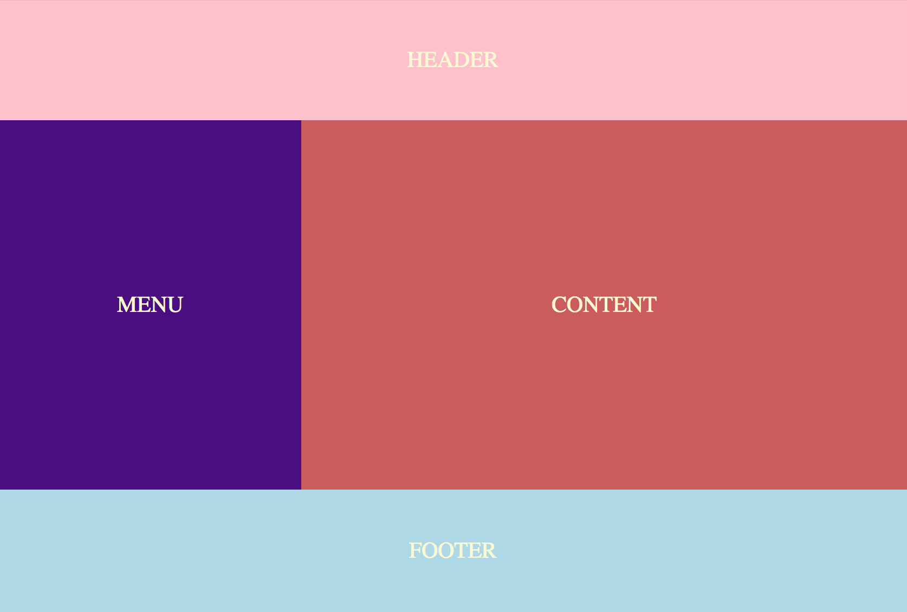

# Sistema de grid

## Contenidos

- Introducción
- ¿Para qué sirve lo que vamos a ver en esta sesión?
- CSS grid
- Bootstrap
- Recursos externos


## Introducción

Un sistema de grid o rejilla, nos permite disponer los elementos de una página y que estén alineados. Va a existir una rejilla imaginaria de filas y columnas, a partir de la cual vamos a colocar los elementos de nuestra web. El uso de un sistema de grid tiene sentido si acompaña un diseño que usa también una rejilla.


## ¿Para qué sirve lo que vamos a ver en esta sesión?

Un sistema de grid nos sirve para posicionar los elementos de la página alineados. Se usa en un montón de webs, por ejemplo, este ejemplo de Google.


Podemos ver que los elementos están dispuestos en filas y columnas. Hay 4 columnas que se ven claramente, con un elemento que se expande en 2. Aunque a simple vista parecen no estar alineados en filas, todas las cajas tienen una altura proporcional a una base.

Vamos a ver 2 herramientas que nos facilitan crear una composición basada en grid: CSS grid y Bootstrap.

## CSS grid

CSS grid es una nueva característica de CSS que permite tener un sistema de grid de forma nativa en CSS. Es una herramienta compleja, así que vamos a ver las bases de cómo poder usarla.

En primer lugar, existen 2 tipos de elementos, el contenedor del grid y los elementos del grid. En este sentido, es similar a algo que ya conocemos: flexbox.

Para comenzar, usaremos en el contenedor la propiedad `display:grid` y definiremos las filas y columnas de nuestro grid con `grid-template`. Vamos a ver un ejemplo que podéis [jugar en codepen](https://codepen.io/adalab/pen/JMXwbL?editors=1100):

```css
.wrapper{
  display: grid;
  grid-template-columns: 1fr 1fr 1fr 1fr;
  grid-template-rows: 40px 200px 40px;
}
```
En este grid vamos a tener 4 columnas, cada una de tamaño `1fr`, que es una medida sobre el espacio disponible (free space). Por tanto, se divide el espacio disponible en 4 partes para las columnas. Para las filas, tendremos 3 de 40, 200 y 40px respectivamente.

A continuación, indicaremos a los elementos si queremos que ocupen una o varias filas o columnas con las propiedades `grid-column` y `grid-row`.

```css
.item1 {
    grid-column-start: 1;
    grid-column-end: 4;
}
```
Esto indica que se expande desde la primera línea de grid hasta la cuarta, es decir, ocupa las 3 primeras columnas.
> NOTA: si tenemos 4 columnas, tendremos 5 líneas de grid. Es decir, siempre vamos a tener una más que el número de filas o columnas.

Podemos escribir lo anterior de una forma simplificada:
```css
.item1 {
    grid-column: 1 / 4;
}
```
Para las filas funciona exactamente igual:
```css
.item3 {
    grid-row-start: 2;
    grid-row-end: 4;
}
```

También podemos indicar el tamaño del espaciado de elementos en el contenedor con la propiedad `grid-gap`. Podemos indicar 2 valores si queremos espaciado distinto entre filas y columnas.

***
EJERCICIO 1

Partiendo del ejemplo de codepen, conseguid una composición como la de la imagen.


***

A la hora de posicionar los elementos en el grid, también podemos usar la palabra `span` para indicar cuánto se expande desde la fila/columna actual. Por ejemplo, para el `item1` que se expandía desde la línea de grid 1 a la 4 podríamos usar:

```css
.item1 {
    grid-column: span 3;
}
```

***

EJERCICIO 2

Vamos a modificar el ejercicio anterior para usar `span` en vez de punto inicial y final.

***

EJERCICIO 3

Vamos a crear un grid de 12 columnas y 3 filas, la primera y la última ocupan el 20% del alto del viewport. Crearemos la composición de la imagen.



***

El soporte el navegadores de CSS grid aún no es completo pero a día de hoy (diciembre de 2017) es de [más del 70% según caniuse](https://caniuse.com/#feat=css-grid). Para los casos en que aún no podamos usarlo, tenemos como alternativa usar el sistema de grid que nos ofrece Bootstrap.

## Bootstrap

Boostrap es una librería de componentes gráficos que creó uno de los desarrolladores de Twitter. La librería ofrece un montón de funcionalidad, desde elementos de UI (botones, dropdowns, menús, etc.), hasta componentes interactivos con JavaScript como un carrusel de fotografías.

Para poder usarlo en nuestro proyecto, tendremos varias opciones:
1. Descargar el código fuente (CSS, JS), y enlazarlo desde nuestro HTML
2. Enlazar el código alojado en un servidor de Internet, lo que suele llamarse CDN

Usando esta segunda opción, simplemente pegamos el snippet que [Bootstrap nos da en su página de inicio](https://getbootstrap.com/). Si sólo queremos usar el CSS usamos esto en nuestro `header`:

```hmtl
<link rel="stylesheet" href="https://maxcdn.bootstrapcdn.com/bootstrap/4.0.0-beta.2/css/bootstrap.min.css" integrity="sha384-PsH8R72JQ3SOdhVi3uxftmaW6Vc51MKb0q5P2rRUpPvrszuE4W1povHYgTpBfshb" crossorigin="anonymous">

```

Entre todas las funcionalidades que nos ofrece Bootstrap, cuenta con un sistema de grid sencillo de 12 columnas. Siempre partimos de la base de 12 columnas para distribuir el espacio disponible en la web. En el CSS que hemos importado, tenemos una serie de clases que nos van a permitir construir nuestra web con un grid.

Como base usaremos un elemento `container` que contiene nuestro grid (como el wrapper de CSS grid) o `container-fluid` si queremos que ocupe todo el ancho y sea fluido. Luego usaremos un elemento con la clase `row` para indicar que es una nueva fila, y dentro podremos los elementos correspondientes. En cada fila podremos indicar el número de columnas a usar con las clases `col-num`, por ejemplo, `col-1`, `col-6`, `col-12`. Veamos un ejemplo.

```html
<div class="container-fluid">
  <div class="row">
    <div class="header col-12">HEADER</div>
  </div>
  <div class="row">
    <div class="header col-12">HERO</div>
  </div>
  <div class="row">
    <div class="menu col-8">CONTENT</div>
    <div class="content col-4">ASIDE</div>
  </div>
  <div class="row">
    <div class="footer col-12">FOOTER</div>
  </div>
</div>
```

***

EJERCICIO 4

Vamos a crear la composición del ejercicio 3 con Bootstrap para ver las diferencias de uso respecto a CSS grid.

***

## Recursos externos

- [Frontazo - pensando en grid](https://vimeo.com/98141102)
- [Learn CSS grid](http://learncssgrid.com/)
- [Grid de Bootstrap](https://getbootstrap.com/docs/4.0/layout/grid/)
